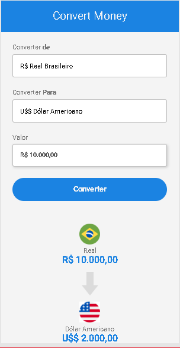

<h1 style= "text-align: center"> Convert Money</h1>

 Esse é um conversor de moedas que fiz apenas para praticar HTML, CSS e JavaScript. 

 

 Os valores são apenas aproximados dos valores reais de cada moeda.

